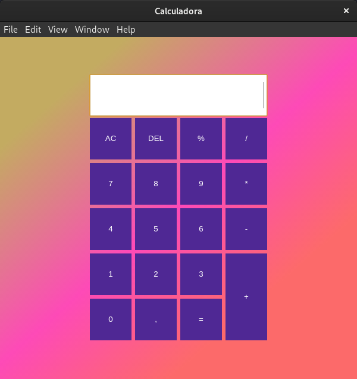

<h1>Uma calculadora simples para treinar os conceitos basicos de React junto com electron</h1>

 

<h1>Executando Projeto</h1>
<h2>Primeiro instale as dependencias usando o comando.</h2>
<code>npm install</code>
<h2>Para executar o projeto use o comando</h2>
<code>npm electron</code>
